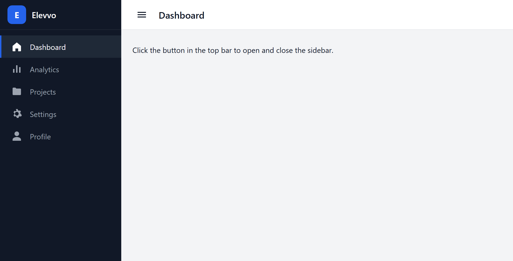
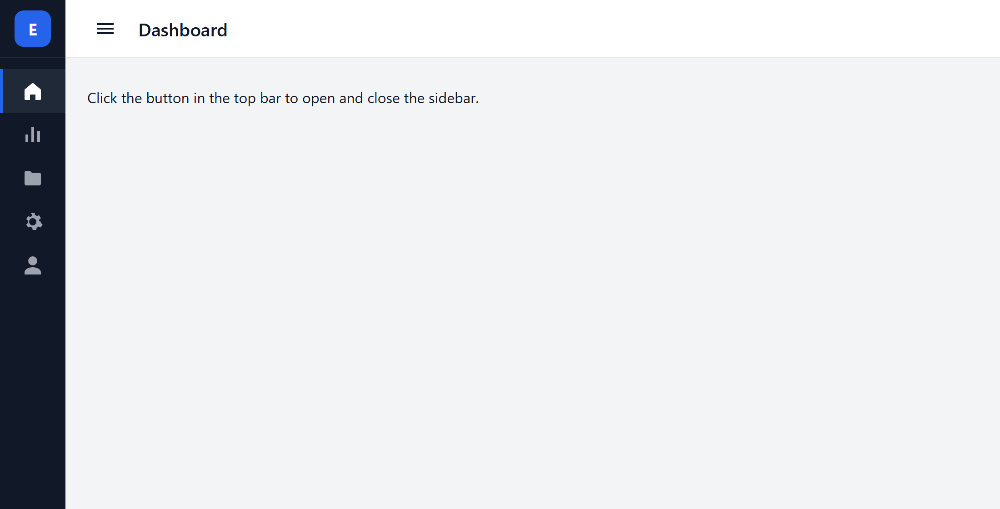

# Task 1 — Collapsible Sidebar

A dashboard sidebar that opens and closes, built with plain HTML, CSS and
JavaScript, as part of the Elevvo Front-End Web Development internship.

## Screenshots





## What it does

- A logo placeholder at the top and five links, each with its own icon
- A button in the top bar opens and closes the sidebar
- The width animates instead of jumping, and the labels fade with it
- On a phone the sidebar slides off the screen rather than shrinking,
  starts closed, and closes again after a link is picked
- The button reports its state with `aria-expanded` for screen readers

## How the collapsing works

JavaScript only adds or removes one class:
```js
sidebar.classList.toggle("collapsed", collapsed);
```

Everything else is CSS: `.sidebar` has `transition: width`, and
`.sidebar.collapsed` sets the smaller width, so the browser animates the
change itself.

## Built with

- HTML5 — semantic `aside`, `nav`, `main` and `header`
- CSS3 — custom properties, Flexbox, transitions, one media query
- JavaScript — no libraries
- Icons — inline SVG, so there is nothing to download

## Running it

Open `index.html` in a browser. There is nothing to install or build.